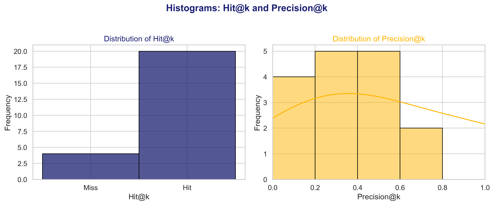

# 📊 RAG Evaluation Report

## 📈 Metric Distributions

## ✅ Summary Table

| Metric               |   Value |
|----------------------|---------|
| Mean Hit@k           |   0.833 |
| Mean Precision@k     |   0.646 |
| Mean Reciprocal Rank |   0.385 |
| Hit Count            |  20     |
| Miss Count           |   4     |
| Total Samples        |  24     |